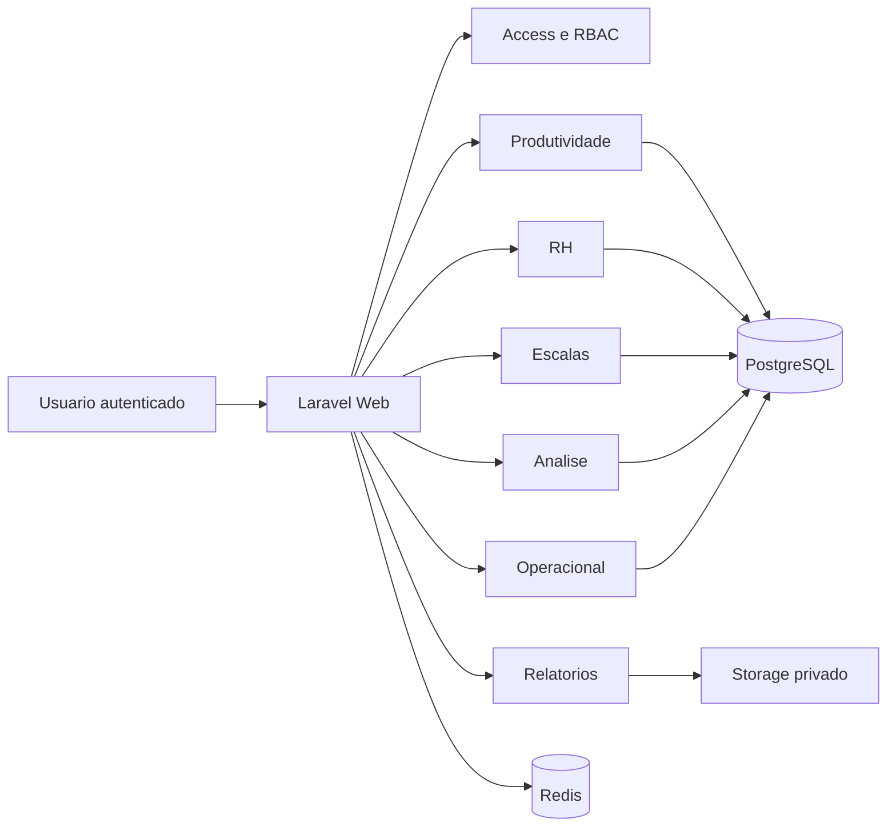

# Arquitetura Alvo

## Problema atual

O sistema atual combina:
- desktop PyQt;
- SQLite acessado diretamente por modulos e telas;
- relatorios gerados por multiplos motores;
- caminhos locais e comportamento dependente de Windows;
- acoplamento forte entre UI, regra de negocio e persistencia.

Isso dificulta:
- uso remoto seguro;
- controle de acesso por usuario e atribuicao;
- manutencao de longo prazo;
- homologacao por modulo;
- restauracao previsivel em caso de incidente.

## Decisao arquitetural

O novo GROM sera um monolito modular em PHP, com dominio separado por contexto de negocio.

Stack alvo:
- PHP 8.3+;
- Laravel 12;
- Blade e componentes server-driven para o backoffice;
- PostgreSQL como banco principal;
- Redis para fila, cache e rate limit;
- Nginx + PHP-FPM;
- armazenamento privado para arquivos, backups e relatorios;
- servico unico de relatorios com templates versionados.

## Por que esta arquitetura

Razoes principais:
- menos pontos de falha do que SPA + API + varios microservicos;
- manutencao mais previsivel para 10 anos;
- autenticacao, autorizacao, fila, scheduler e logging suportados pela plataforma;
- melhor aderencia a CRUD, pesquisa, consolidacao, importacao e painel administrativo;
- hospedagem mais simples em ambiente PHP profissional.

## Contextos de negocio

O sistema web sera organizado pelos seguintes dominios:

1. Access
- usuarios;
- perfis;
- permissoes;
- escopos por modulo, unidade e cartorio;
- sessoes;
- trilha de autenticacao.

2. RH
- funcionarios;
- cargos;
- afastamentos;
- delegados externos.

3. Escalas
- escalas mensais;
- plantoes;
- feriados;
- regras de fechamento.

4. Produtividade
- cartorios;
- historico de status e responsavel;
- estatisticas mensais;
- flagrantes;
- confirmacao manual de sugestoes vindas da analise.

5. Analise de Dados
- importacao segura;
- staging de consolidacao;
- vinculos SPJ/IP/IP-e/CNJ;
- consulta por periodo;
- exportacoes e trilha de consolidacao.

6. Operacional
- mandados;
- objetos apreendidos;
- relatorios operacionais.

7. Relatorios
- templates A4;
- timbrado oficial;
- exportacao PDF/XLSX;
- historico de emissao;
- aprovacao visual.

## Camadas internas

Cada contexto tera as seguintes camadas:
- `Domain`: entidades, regras, invariantes e politicas.
- `Application`: casos de uso, comandos, consultas e orquestracao.
- `Infrastructure`: Eloquent, repositorios, fila, cache, storage, PDF.
- `Http`: controllers, requests, resources, policies e middlewares.

## Fronteiras importantes

Regras de projeto:
- nenhuma tela acessa banco diretamente;
- nenhum modulo escreve em tabela de outro modulo sem caso de uso explicito;
- relatorios nao consultam banco "por fora";
- integracoes entram por staging e confirmacao manual quando a regra exigir;
- auditoria e autorizacao sao transversais, nao opcionais.

## Multimodulo sem microservicos

Nao vamos copiar a estrutura atual de pastas 1:1.
Vamos reconstruir por dominio:
- `Access`
- `Rh`
- `Escalas`
- `Produtividade`
- `Analise`
- `Operacional`
- `Relatorios`

Isso permite:
- testes por modulo;
- corte por dominio;
- menor chance de regressao lateral;
- leitura de codigo muito mais clara.

## Fluxo de alto nivel

## Decisoes adicionais

- O servidor nao sera Windows.
- O cliente acessa via navegador com HTTPS.
- O Python sera mantido como contingencia ate o fim da homologacao.
- O timbrado vira template oficial versionado.
- O SQLite atual sera tratado como base de extracao e conferencia.

